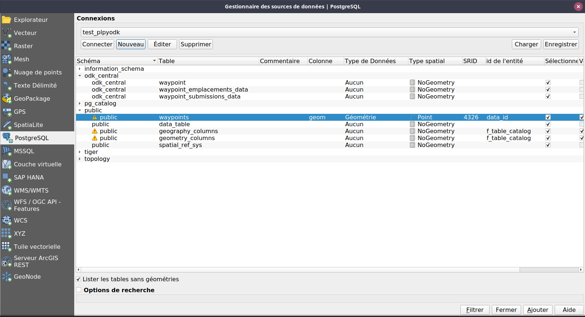
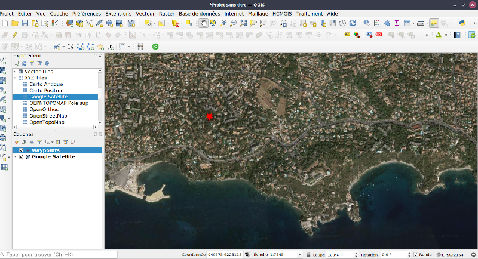

# pl-pyODK
## First version of functions that pull data from ODK central using a filter and automatically creates table in your PostgreSQL database
-> for example from last submission_date known in the database

[ODK Central](https://docs.getodk.org/central-intro/) gives all datas by default.
We use [ODK Collect](https://docs.getodk.org/collect-intro/) every day to collect data that goes and is edited in our own [PostGIS](https://postgis.net) database.
Each day we download hourly a lot of data with  [Central2pg](https://github.com/mathieubossaert/central2pg).
It works really fine but most of the downloaded data has already been consolidated into our GIS database. We just need the last ones.

Thanks to [pyODK](https://getodk.github.io/pyodk/) and [pl/python](https://www.postgresql.org/docs/current/plpython.html) we can now ask central for the only data that are not already in our database, so maybe 30 or 40 submissions instead of 5000 ;-)

pl/pyDOK in this workflow :


## Requirements
### pl/python langage installed on you databse
```sql
CREATE OR REPLACE PROCEDURAL LANGUAGE plpython3u;
```
## Installation

### Install pyodk library on the database host

On the database server
```sh
pip install -U pyodk
```
### Set pyODK config file

Edit the .template_pyodk_config.toml file and save it as .pyodk_config.toml

.pyodk_config.toml conf file must exists in Postgresql directory (ie /var/lib/postgresql/)


```toml
[central]
base_url = "https://my_central_server.url"
username = "my_username"
password = "my_password"
default_project_id = 5
```
### Run the sql script on your own database
```sh
psql -f pl-pyODK.sql -U my_ser my_database
```

### Then you can jump to the SQL party 
[just below](https://github.com/mathieubossaert/pl-pyodk#play-sql-queries-to-get-datas-from-central-and-do-whatever-you-want-with-it-in-your-own-database)

## Using the docker image for test (only)
### Set pyODK config file

```sh
cd docker_postgis_curl_plpython_pgcron
```

Edit the .template_pyodk_config.toml file and save it as .pyodk_config.toml

### Build and run the container

```sh
sudo docker build -t postgis:test_pyodk .
sudo docker run --restart="always" --dns 1.1.1.1 --name test_plpyodk -e POSTGRES_DB=field_data -e POSTGRES_USER=tester -e POSTGRES_PASSWORD=testerpwd -d -p 5555:5432 postgis:test_pyodk
```
### Connect to the database

You can now connect to the database with your favorite client:
* host = **localhost**
* port = 5555
* user = **tester**
* password = **testerpwd**
* dbname = **field_data**

### Play SQL queries to get datas from Central and do whatever you want with it in your own database.

Test with the form you want on your central server :

```sql
SELECT plpyodk.odk_central_to_pg(
	3,                  -- the project id, 
	'waypoint',         -- form ID
	'odk_central',      -- schema where to create tables and store data
	'filter_to_use',    -- the filter "clause" used in the API call ex. '__system/submissionDate ge 2023-04-01'. Empty string ('') will get all the datas. 
	'point_auto_5,point_auto_10,point_auto_15,point,ligne,polygone'	-- (geo)columns to ignore in json transformation to database attributes (geojson fields of GeoWidgets)
);
```

Or try the example abose, wich make use of this form : https://biodiversityforms.org/docs/ODK-CEN/donnees_opportunistes/ODK_waypoints

1. First upload it to you central server, note the project id (3 in our instance), the form_id (waypoint), and the name of each "geo" question in the form in order to not explore its json value (point_auto_5,point_auto_10,point_auto_15,point,ligne,polygone)
.
2. Send some submissions to central.

3. Now you are ready to make the first call, that will download all the data submittted for this form. The filter parametrer may be set to an empty string.

```sql
SELECT plpyodk.odk_central_to_pg(
	3,                    -- the project id
	'waypoint'::text,     -- form ID
	'odk_central'::text,  -- schema where to create tables and store data
	'',                   -- the filter "clause" used in the API call
	'point_auto_5,point_auto_10,point_auto_15,point,ligne,polygone'::text -- json (geo)columns to ignore
);
```
4. Check the data you got from central's database
```sql
SELECT * FROM odk_central.waypoint_submissions_data
SELECT * FROM odk_central.waypoint_emplacements_data;
```
5. Now we can perform a query that uses last submission date (column "submissionDate") as a parameter in the function call.
```sql
-- or this to get only datas collected since last known submissionDate in the database

CREATE MATERIALIZED VIEW IF NOT EXISTS odk_central.waypoint_last_submission_date AS 
	SELECT max("submissionDate")::text AS last_submission_date
	FROM odk_central.waypoint_submissions_data;

REFRESH MATERIALIZED VIEW odk_central.waypoint_last_submission_date;

SELECT plpyodk.odk_central_to_pg(
	3,
	'waypoint'::text,
	'odk_central'::text,
	concat('__system/submissionDate ge ',last_submission_date),
	'point_auto_5,point_auto_10,point_auto_15,point,ligne,polygone'::text
)
FROM odk_central.waypoint_last_submission_date;
```
6. Send new submissions to central
7. Run last query at the frequency you want, manually
You can save your script in a sql file like **get_waypoint_data.sql** and then call it with psql :
```sh
psql -h localhost -p 5555 -U tester -f get_waypoint_data.sql -d field_data
```
8. Or you may want to define a cron task
Adapt and add such a line to your cron list. See https://crontab.guru/ to learn about cron task scheduling.
```bash
crontab -e
```
For example, to run the script every day at 18:00, add this line to the crontab :
> 0 18 * * *  psql -h localhost -p 5555 -U tester -f get_waypoint_data.sql -d field_data

## Show datas on a map with QGIS
### View creation
```sql
CREATE VIEW waypoints AS 
SELECT places.data_id, date_heure, mail_observateur as email, nom_observateur, etiquette, heure_localite, 
st_force2d(st_geomfromgeojson(replace(COALESCE(ligne, point, point_auto_10, point_auto_15, point_auto_5, polygone),'\','')))::geometry(geometry, 4326) AS geom, prise_image, remarque
FROM odk_central.waypoint_submissions_data submissions JOIN  odk_central.waypoint_emplacements_data places ON places."__Submissions-id" = submissions."__id"
```

### Configure the PostGIS datasource in QGIS


### Connect and add the publi.waypoints "layer" to the canvas





### rerun steps 6 and 7 the refresh the QGIS canvas ;-)
