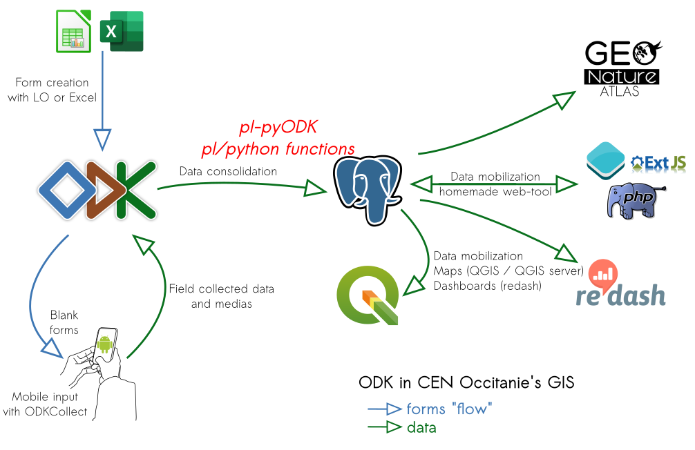
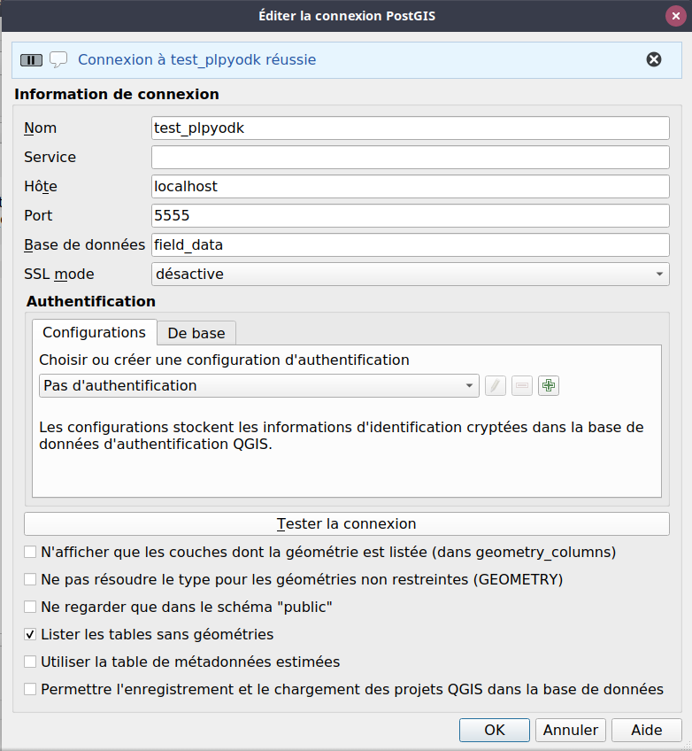
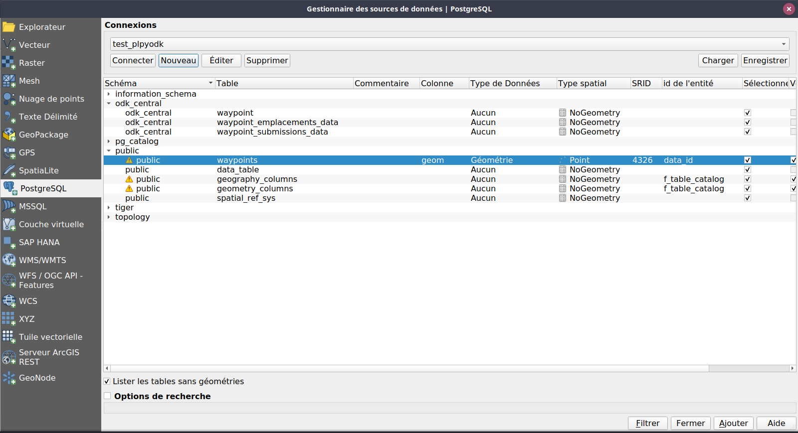
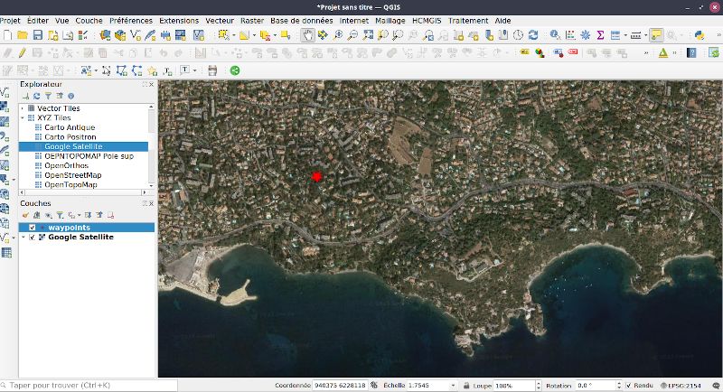

# pl-pyODK
## Première version de fonctions qui extraient des données d'ODK Central, même en utilisant un filtre, et qui créent automatiquement des tables dédiées dans votre base de données PostgreSQL.
-> par exemple les données soumises depuis la dernière date de soumission connue en base (seulement les nouvelles données)

[ODK Central](https://docs.getodk.org/central-intro/) retourne toutes les données par défaut.
Nous utilisons [ODK Collect](https://docs.getodk.org/collect-intro/) tous les jours pour collecter des données qui vont et sont éditées dans notre propre base de données [PostGIS](https://postgis.net).
Chaque jour, nous téléchargeons toutes les heures un grand nombre de données avec [Central2pg](https://github.com/mathieubossaert/central2pg).
Cela fonctionne très bien, mais la plupart des données téléchargées ont déjà été consolidées dans notre base de données SIG. Nous n'avons besoin que des données nouvellement créées.

Grâce à [pyODK](https://getodk.github.io/pyodk/) et [pl/python](https://www.postgresql.org/docs/current/plpython.html) nous pouvons maintenant demander à Central les seules données qui ne sont pas déjà dans notre base de données, donc peut-être 30 ou 40 soumissions au lieu de 5000 ;-)

pl/pyDOK dans la chaine de traitements :



## Prérequis
### pl/python doit être installé dans votre base de données
```sql
CREATE OR REPLACE PROCEDURAL LANGUAGE plpython3u;
```
## Installation

### Installer la librairie pyodk sur l'hôte de votre serveur de base de données

Sur votre serveur
```sh
pip install -U pyodk
```
### Paramétrer le fichier de configuration de pyodk

Editer le fichier .template_pyodk_config.toml et l'enregistrer en tant que .pyodk_config.toml

le fichier .pyodk_config.toml doit exister dans le répertoire de Postgresql (ie /var/lib/postgresql/)


```toml
[central]
base_url = "https://my_central_server.url"
username = "my_username"
password = "my_password"
default_project_id = 5
```
### Exécuter le script sql dans votre base de données
```sh
psql -f pl-pyODK.sql -U my_ser my_database
```

### Maintenant vous pouvez passer à la fête SQL
[ci-dessous](https://github.com/mathieubossaert/pl-pyodk#play-sql-queries-to-get-datas-from-central-and-do-whatever-you-want-with-it-in-your-own-database)

## Utilisation de l'image docker pour tests (uniquement)
### Set pyODK config file

```sh
cd docker_postgis_curl_plpython_pgcron
```

Editer le fichier .template_pyodk_config.toml et l'enegistrer en tant que .pyodk_config.toml

### Construire et lancer le conteneur (Build and run)

```sh
sudo docker build -t postgis:test_pyodk .
sudo docker run --restart="always" --dns 1.1.1.1 --name test_plpyodk -e POSTGRES_DB=field_data -e POSTGRES_USER=tester -e POSTGRES_PASSWORD=testerpwd -d -p 5555:5432 postgis:test_pyodk
```
### Connection à la base de données

Vous pouvez maintenant vous connecter à la base de données avec votre client préféré :
* host = **localhost**
* port = 5555
* user = **tester**
* password = **testerpwd**
* dbname = **field_data**

### Executez des requêtes SQL pour récupérer des données de Central et faites en ce que vous voudrez dans votre propre base de données..

Testez avec le formuliare de votre choix sur votre serveur ODK Central :

```sql
SELECT plpyodk.odk_central_to_pg(
	3,                  -- the project id, 
	'waypoint',         -- form ID
	'odk_central',      -- schema where to create tables and store data
	'filter_to_use',    -- the filter "clause" used in the API call ex. '__system/submissionDate ge 2023-04-01'. Empty string ('') will get all the datas. 
	'point_auto_5,point_auto_10,point_auto_15,point,ligne,polygone'	-- (geo)columns to ignore in json transformation to database attributes (geojson fields of GeoWidgets)
);
```

Or try the example abose, wich make use of this form : https://biodiversityforms.org/docs/ODK-CEN/donnees_opportunistes/ODK_waypoints

1. First upload it to you central server, note the project id (3 in our instance), the form_id (waypoint), and the name of each "geo" question in the form in order to not explore its json value (point_auto_5,point_auto_10,point_auto_15,point,ligne,polygone)
.
2. Send some submissions to central.

3. Now you are ready to make the first call, that will download all the data submittted for this form. The filter parametrer may be set to an empty string.

```sql
SELECT plpyodk.odk_central_to_pg(
	3,                    -- the project id
	'waypoint'::text,     -- form ID
	'odk_central'::text,  -- schema where to create tables and store data
	'',                   -- the filter "clause" used in the API call
	'point_auto_5,point_auto_10,point_auto_15,point,ligne,polygone'::text -- json (geo)columns to ignore
);
```
4. Check the data you got from central's database
```sql
SELECT * FROM odk_central.waypoint_submissions_data
SELECT * FROM odk_central.waypoint_emplacements_data;
```
5. Now we can perform a query that uses last submission date (column "submissionDate") as a parameter in the function call.
```sql
-- or this to get only datas collected since last known submissionDate in the database

CREATE MATERIALIZED VIEW IF NOT EXISTS odk_central.waypoint_last_submission_date AS 
	SELECT max("submissionDate")::text AS last_submission_date
	FROM odk_central.waypoint_submissions_data;

REFRESH MATERIALIZED VIEW odk_central.waypoint_last_submission_date;

SELECT plpyodk.odk_central_to_pg(
	3,
	'waypoint'::text,
	'odk_central'::text,
	concat('__system/submissionDate ge ',last_submission_date),
	'point_auto_5,point_auto_10,point_auto_15,point,ligne,polygone'::text
)
FROM odk_central.waypoint_last_submission_date;
```
6. Send new submissions to central
7. Run last query at the frequency you want, manually
You can save your script in a sql file like **get_waypoint_data.sql** and then call it with psql :
```sh
psql -h localhost -p 5555 -U tester -f get_waypoint_data.sql -d field_data
```
8. Or you may want to define a cron task
Adapt and add such a line to your cron list. See https://crontab.guru/ to learn about cron task scheduling.
```bash
crontab -e
```
For example, to run the script every day at 18:00, add this line to the crontab :
> 0 18 * * *  psql -h localhost -p 5555 -U tester -f get_waypoint_data.sql -d field_data

## How to show datas on a map with QGIS
### View creation
```sql
CREATE VIEW waypoints AS 
SELECT places.data_id, date_heure, mail_observateur as email, nom_observateur, etiquette, heure_localite, 
st_force2d(st_geomfromgeojson(replace(COALESCE(ligne, point, point_auto_10, point_auto_15, point_auto_5, polygone),'\','')))::geometry(geometry, 4326) AS geom, prise_image, remarque
FROM odk_central.waypoint_submissions_data submissions JOIN  odk_central.waypoint_emplacements_data places ON places."__Submissions-id" = submissions."__id"
```

### Configure the PostGIS datasource in QGIS



### Connect and add the public.waypoints view as a "layer" to the canvas





### rerun steps 6 and 7 then refresh the QGIS canvas ;-)
